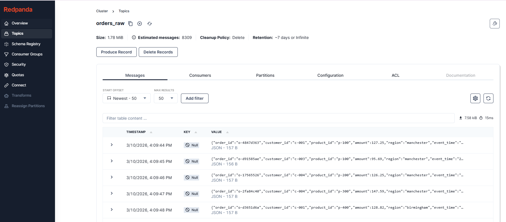
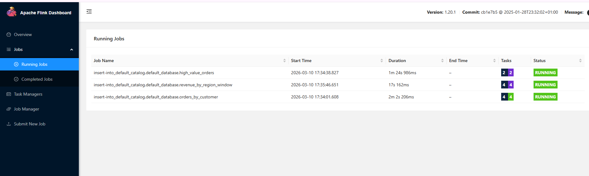
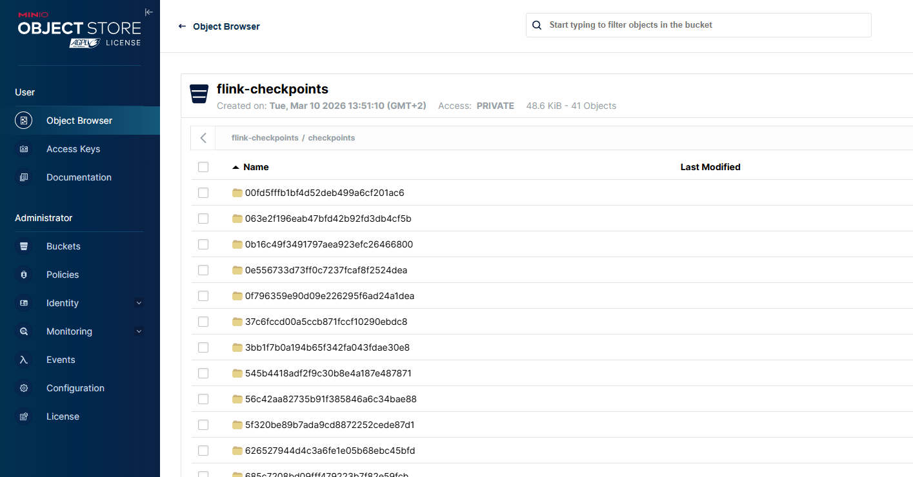

# Evaluation of Apache Flink for Analytics

## TL;DR

### What to run
From the repo root:

```bash
make download-jars
make up
```
### UI links
Useful UIs:

- Flink UI: http://localhost:8082
- Redpanda Console: http://localhost:8081
- MinIO Console: http://localhost:9001

### Jobs
```bash
docker exec -it flink-demo-sql-client /opt/flink/bin/sql-client.sh -f /workspace/jobs/sql/00_setup.sql
docker exec -it flink-demo-sql-client /opt/flink/bin/sql-client.sh -f /workspace/jobs/sql/00_setup.sql
docker exec -it flink-demo-sql-client /opt/flink/bin/sql-client.sh -f /workspace/jobs/sql/00_setup.sql
docker exec -it flink-demo-sql-client /opt/flink/bin/sql-client.sh -f /workspace/jobs/sql/00_setup.sql
docker exec -it flink-demo-sql-client /opt/flink/bin/sql-client.sh -f /workspace/jobs/sql/00_setup.sql
docker exec -it flink-demo-sql-client /opt/flink/bin/sql-client.sh -f /workspace/jobs/sql/00_setup.sql

# OR 
make job 00 # will run /workspace/jobs/sql/00_setup.sql)"
make job 01 # will run /workspace/jobs/sql/01_high_value_orders.sql"
make job 02 # will run /workspace/jobs/sql/02_windowed_revenue_by_region.sql"
make job 03 # will run /workspace/jobs/sql/03_order_counts_by_region.sql"
make job 04 # will run /workspace/jobs/sql/04_print_debug.sql"
make job 05 # will run /workspace/jobs/sql/05_cleanup.sql"
make job 06 # will run /workspace/jobs/sql/06_filesystem_sink.sql"

```
### UI

## Redpanda UI EXample



## Flink UI Example



## MinIO UI Example
```bash
MINIO_ROOT_USER: minio
MINIO_ROOT_PASSWORD: minio123
```



### Nuclear Reset

```bash
make clean
```


## What Flink is, in one slightly silly sentence

Apache Flink is the extremely awake coworker of the data engineering world: it reads events as they happen, remembers what mattered, keeps receipts via checkpoints, and keeps updating the answer while everyone else is still waiting for the batch job to finish.

### Quick verdict

Apache Flink appears to be a strong fit for real-time and stateful analytics, especially when the use case requires:

- continuous ingestion from event streams
- aggregations over live data
- event-time windowing
- durable state
- fault tolerance / recovery

It is less attractive where the requirement is only simple batch transformation or where the operational complexity of a distributed streaming engine is not justified.


1. Purpose of this evaluation

- This demo was created to evaluate whether Apache Flink is an appropriate platform for analytics workloads.

The core question is:

***Is Flink a good fit for analytics scenarios where data arrives continuously and results are expected to update in near real time?***

This local stack is intended to make that answer tangible by showing how Flink behaves in practice with a small but realistic streaming example.


2. Evaluation scope

This evaluation focuses on:

- local developer setup and operability
- integration with Kafka-compatible event brokers
- SQL-based streaming analytics
- stateful aggregations
- event-time processing and windows
- checkpointing and state durability
- conceptual fit for analytics workloads

This evaluation does not attempt to cover:

- production hardening
- full security setup
- large-scale performance benchmarking
- multi-tenant operations
- full lakehouse integration


3. Demo stack used

The local evaluation stack consists of:

- Apache Flink
  - JobManager
  - TaskManager
  - SQL Client
- Redpanda
  - Kafka-compatible event broker
- MinIO
  - S3-compatible object storage
- Python producer
  - synthetic order-event generator

This combination gives a simple but effective testbed for evaluating streaming analytics behavior.


4. Basic startup instructions

Prerequisites

Recommended tools:

- Docker
- Docker Compose
- GNU Make
- Bash / shell
- wget
- Linux/macOS or WSL2 on Windows

## Setup steps


```bash
# Download required Flink connector jars:
make download-jars

# Start the stack:
make up

# Check services:
make ps

# Open the main UIs:
- Flink UI: http://localhost:8082
- Redpanda Console: http://localhost:8081
- MinIO Console: http://localhost:9001

# Submit the main demo SQL job:
docker exec -it flink-demo-sql-client /opt/flink/bin/sql-client.sh -f /workspace/jobs/sql/00_setup.sql

# Check submitted jobs:
curl http://localhost:8082/jobs/overview


# Tail producer logs:
make producer-logs

# Stop the stack:
make down

# Full reset:
make clean

```

5. Mental model: how Flink works

A useful mental model for Flink is:

Flink continuously reads events from a stream, keeps state while computing results, periodically checkpoints that state, and updates downstream outputs as new events arrive.

Another way to explain it:

- Redpanda/Kafka stores the stream of events
- Flink performs the live computation over that stream
- MinIO stores state snapshots so Flink can recover if something breaks

### 5.1 Streams, not files

Traditional analytics often works on static datasets.

Flink is built for unbounded data:

- events arrive continuously
- the job does not “finish”
- results keep updating over time

In this demo, the orders_raw topic is such a stream.

### 5.2 Tables over streams

Flink SQL lets us represent Kafka topics as tables.

That means the problem becomes easier to think about:

- source topic -> source table
- SQL query -> live computation
- sink table -> sink topic / output

This is one of Flink’s main strengths for analytics teams: it makes stream processing accessible through familiar SQL abstractions.

### 5.3 Stateful computation

Aggregations require memory.

For example, if Flink computes:

- total orders by customer
- revenue by region
- order counts per 1-minute window

it must remember prior events.

That remembered information is state.

This is central to understanding Flink:
streaming analytics becomes powerful when the engine can maintain state safely and continuously.

### 5.4 Event time and watermarks

Events do not always arrive in order.

Flink can reason about the time the event actually occurred using event time instead of just processing time.

Watermarks help Flink decide how long to wait for late events before moving a window forward.

This matters because analytics questions are often time-based:

- orders per minute
- revenue per hour
- activity trends over windows

### 5.5 Checkpoints

State is only useful if it is durable.

Flink periodically creates checkpoints, which are consistent snapshots of the job state.

If the job fails, Flink can recover from a checkpoint instead of restarting from scratch.

In this demo, checkpoints/savepoints are configured to use MinIO.

This is a major part of the Flink value proposition for analytics:
it is not just streaming, it is reliable stateful streaming.


6. Dataflow in this example

The demo uses synthetic order events.

### 6.1 Input event shape

Example event:
```bash
{
  "order_id": "o-1234abcd",
  "customer_id": "c-003",
  "product_id": "p-200",
  "amount": 142.50,
  "region": "london",
  "event_time": "2026-03-10T13:00:15.123Z"
}
```

### 6.2 End-to-end flow
```bash
Python producer
    ->
Redpanda topic: orders_raw
    ->
Flink source table: orders_raw
    ->
SQL transformation / aggregation
    ->
sink topic or sink output
```
### 6.3 Example transformations

The demo supports scenarios such as:

- aggregate by customer
- filter high-value orders
- revenue by region in tumbling windows
- print sink for debugging
- filesystem sink for file output

### 6.4 Why this is useful for evaluation

This dataflow demonstrates several analytics-relevant concerns in one place:

- continuous ingestion
- source/sink integration
- stateful computation
- event-time behavior
- output materialization


7. What the demo proves

### 7.1 Flink can be run locally with a realistic supporting stack

The local stack is workable and understandable once the connector/runtime details are correctly configured.

This is important because local developer experience often determines whether a technology is practical to adopt.

### 7.2 Flink SQL provides a strong entry point for analytics

For analytics evaluation, Flink SQL is one of the most approachable aspects of the platform.

It allows streaming analytics to be described in a way that is familiar to data engineers and analysts.

### 7.3 Stateful aggregations are a first-class strength

The customer aggregation example shows the core value of Flink:

- continuously updating grouped results
- durable state
- live outputs to downstream topics

This is a strong fit for operational analytics and real-time metric computation.

### 7.4 Windowed analytics is a meaningful differentiator

The region/window example shows why Flink is more than “just another stream consumer.”

Windowing over event time is one of the strongest reasons to adopt Flink for analytics use cases.

### 7.5 Checkpointing meaningfully improves reliability

Checkpointing is a major strength in stateful analytics systems.

A platform that keeps state but cannot recover it safely becomes fragile.
Flink’s checkpoint model is one of the reasons it is frequently considered for serious streaming analytics.


8. What was learned during setup

Several practical lessons emerged from getting the demo working.

### 8.1 Connector jars matter

Flink SQL connectors are not automatically available in all setups.

The Kafka SQL connector and S3 filesystem connector had to be explicitly downloaded and mounted.

This is a reminder that Flink’s power often comes with some assembly required.

### 8.2 JobManager and TaskManager config must be correct

The JobManager needed explicit memory configuration to start correctly.

Until that was fixed:

- the Flink UI was unavailable
- TaskManager could not register correctly
- SQL job submission failed

This highlights that Flink is not “zero-config magic.”

### 8.3 SQL client sessions are important

One important behavioral detail:

separate sql-client.sh -f ... runs do not share temporary table definitions in this setup.

That means each runnable SQL scenario file must be self-contained.

This is not a flaw in Flink, but it is an important usability detail for demo design and local workflows.

### 8.4 Once configured, the stack behaves predictably

After the configuration issues were resolved, the overall system behaved as expected:

- topics were readable
- SQL jobs could be submitted
- JobManager UI was available
- TaskManager registered successfully
- sink jobs could be run in isolation


9. Strengths observed in this evaluation

### 9.1 Strong fit for real-time analytics

Flink is well suited where results need to evolve continuously as data arrives.

### 9.2 Good SQL-based usability

The SQL layer makes the platform significantly easier to evaluate and explain.

### 9.3 Excellent stateful processing model

Flink’s state model is a major strength for grouped aggregations and windowed analytics.

9.4 Event-time support is highly valuable

This is a major advantage over simpler stream-processing setups that only reason about processing time.

9.5 Checkpointing and recovery are meaningful advantages

For long-running analytics jobs, durable state is essential.


10. Weaknesses / trade-offs observed

### 10.1 More moving parts than simpler tools

Even for a local demo, the platform requires:

- cluster components
- connector jars
- runtime configuration
- state backend/storage consideration

### 10.2 Operational complexity is non-trivial

Compared to simpler consumer scripts or batch SQL tools, Flink has a steeper operational learning curve.

### 10.3 Session/catalog behavior can surprise new users

The SQL client session model can be unintuitive if someone expects table definitions to persist automatically across runs.

### 10.4 Potential overkill for simple use cases

If the problem is just batch summarization or lightweight scheduled transformation, Flink may be heavier than necessary.


11. Suitability for analytics

Strong fit when:

- data arrives continuously
- analytics results need to update continuously
- stateful aggregations are required
- event-time windows matter
- reliability and restart/recovery matter

Weaker fit when:

- workloads are mostly batch
- transformations are simple and stateless
- operational simplicity matters more than streaming power
- the business does not need continuously updated analytics


12. Evaluation conclusion

Apache Flink appears to be a good fit for analytics workloads that are truly streaming and stateful.

Its strongest characteristics in this evaluation are:

- continuous SQL-based stream processing
- stateful aggregations
- event-time windowing
- checkpoint-based recovery
- good compatibility with Kafka-style brokers and S3-style storage

Its main trade-off is complexity.

In short:

Flink is not the lightest tool in the room, but when the analytics problem is genuinely real-time, stateful, and reliability-sensitive, it starts to make a lot of sense.


13. Recommended usage of this demo

This local stack is useful for:

- explaining the Flink mental model
- demonstrating source -> transform -> sink dataflow
- showing stateful aggregations
- showing event-time windows
- discussing checkpointing and reliability
- evaluating whether the operational overhead feels justified


14. Suggested next steps

Good next improvements for this evaluation include:

- add a savepoint/recovery walkthrough
- add a late-event scenario
- add a second source stream and a join example
- add Prometheus/Grafana metrics
- compare SQL and DataStream API approaches
- document operational complexity more explicitly
- compare Flink with simpler alternatives for the same use case


15. Hyper-brief closing summary

If Kafka is the event log and analytics needs to happen while the firehose is still on, Flink is the part that keeps doing the maths without panicking.
